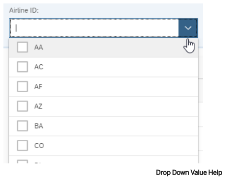

SAP RAP에서 Value Help Via Association에 대해 상세히 설명드리겠습니다.



1. 데이터 모델 정의 (CDS View)
```abap
@EndUserText.label: 'Travel Booking View'
@AccessControl.authorizationCheck: #CHECK
define root view entity ZI_TRAVEL_M
  as select from ztravel_m
  composition [0..*] of ZI_BOOKING_M as _Booking
  association [1..1] to ZI_CUSTOMER as _Customer on $projection.CustomerID = _Customer.CustomerID
  association [1..1] to ZI_AGENCY as _Agency on $projection.AgencyID = _Agency.AgencyID
{
  key travel_uuid as TravelUUID,
  
  @Consumption.valueHelp: '_Customer'  // Value Help Via Association 
  customer_id as CustomerID,
  
  @Consumption.valueHelp: '_Agency'    // Value Help Via Association
  agency_id as AgencyID,
  
  // 연관된 데이터 접근
  _Customer.CustomerName as CustomerName,
  _Agency.AgencyName as AgencyName,
  
  // Associations
  _Booking,
  _Customer,
  _Agency
}
```

2. Customer View (Value Help 대상)
```abap
@EndUserText.label: 'Customer View'
@AccessControl.authorizationCheck: #CHECK
@Search.searchable: true
define view entity ZI_CUSTOMER
  as select from zcustomer
{
  @Search.defaultSearchElement: true
  key customer_id as CustomerID,
  
  @Search.defaultSearchElement: true
  customer_name as CustomerName,
  
  country as Country,
  email as Email
}
```

3. Projection View (Metadata 확장)
```abap
@EndUserText.label: 'Travel Booking Projection View'
@AccessControl.authorizationCheck: #CHECK
define root view entity ZC_TRAVEL_M
  provider contract transactional_query
  as projection on ZI_TRAVEL_M
{
  key TravelUUID,
  
  @Consumption.valueHelp: '_Customer'  // Value Help Association 지정
  @ObjectModel.text.element: ['CustomerName']
  @UI.textArrangement: #TEXT_SEPARATE
  CustomerID,
  
  // Customer 텍스트 필드
  _Customer.CustomerName as CustomerName,
  
  @Consumption.valueHelp: '_Agency'
  @ObjectModel.text.element: ['AgencyName']
  @UI.textArrangement: #TEXT_SEPARATE
  AgencyID,
  
  // Agency 텍스트 필드
  _Agency.AgencyName as AgencyName,
  
  // Associations
  _Customer,
  _Agency
}
```

4. Metadata Extension
```abap
@Metadata.layer: #CORE
annotate view ZC_TRAVEL_M with 
{
  // CustomerID 필드에 대한 Value Help 상세 설정
  @UI.identification: [{ position: 10 }]
  @UI.selectionField: [{ position: 10 }]
  CustomerID;
  
  // AgencyID 필드에 대한 Value Help 상세 설정
  @UI.identification: [{ position: 20 }]
  @UI.selectionField: [{ position: 20 }]
  AgencyID;
}
```

5. Behavior Definition
```abap
define behavior for ZI_TRAVEL_M alias Travel
implementation in class ZBP_TRAVEL_M unique
{
  // 여행 예약에 대한 표준 CRUD 작업
  create;
  update;
  delete;
  
  // 연관된 Booking에 대한 작업
  association _Booking { create; update; delete; }
}
```

Value Help Via Association의 주요 특징:

1. Association 활용
- `@Consumption.valueHelp`: 연관된 엔티티를 Value Help 소스로 지정
- 외부키 필드에 대해 연관된 엔티티의 데이터 제공

2. 텍스트 표시 설정
- `@ObjectModel.text.element`: 연관된 텍스트 필드 지정
- `@UI.textArrangement`: 코드와 텍스트 표시 방식 설정

3. 검색 기능
- `@Search.searchable`: 검색 가능한 뷰로 정의
- `@Search.defaultSearchElement`: 기본 검색 필드 지정

4. UI 통합
- `@UI.identification`: 화면에서 필드 위치 지정
- `@UI.selectionField`: 선택 필드로 지정

장점:
- 데이터 일관성 유지
- 간단한 연관 데이터 조회
- 사용자 친화적인 데이터 입력 지원

구현 시 고려사항:
- 성능 최적화
- 데이터베이스 조인 최소화
- 적절한 인덱스 설계

이 예제는 여행 예약 시스템에서 고객과 여행사 데이터에 대한 Value Help Via Association을 보여줍니다. 실제 프로젝트에서는 비즈니스 요구사항에 맞게 커스터마이징하면 됩니다.
